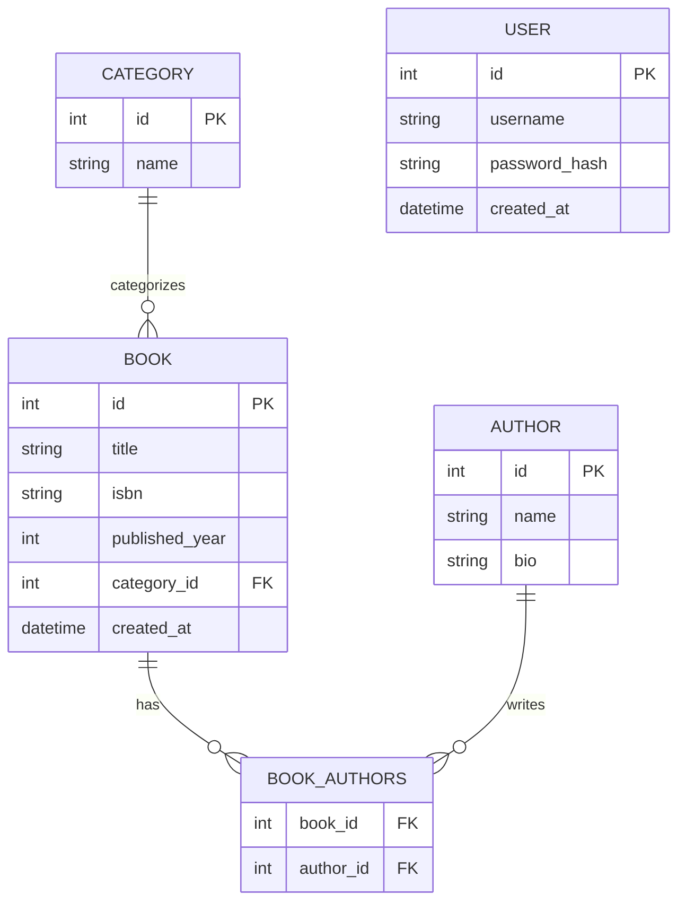

# ER Diagram — Book Management System

## หมายเหตุการออกแบบ

- **Book–Author**: ความสัมพันธ์แบบ N–N ผ่านตาราง junction `book_authors` เนื่องจากโจทย์ระบุ `authorId(s)` (หนึ่งเล่มอาจมีหลายผู้แต่ง)
- **Category–Book**: ความสัมพันธ์แบบ 1–N เนื่องจาก endpoint filter `?categoryId=2` รับค่าเดียวต่อเล่ม
- **User**: แยกออกจาก Author โดยเจตนา — User คือบัญชีสำหรับ authentication ส่วน Author คือข้อมูลผู้แต่งหนังสือ (business entity) ไม่ผูกกัน
